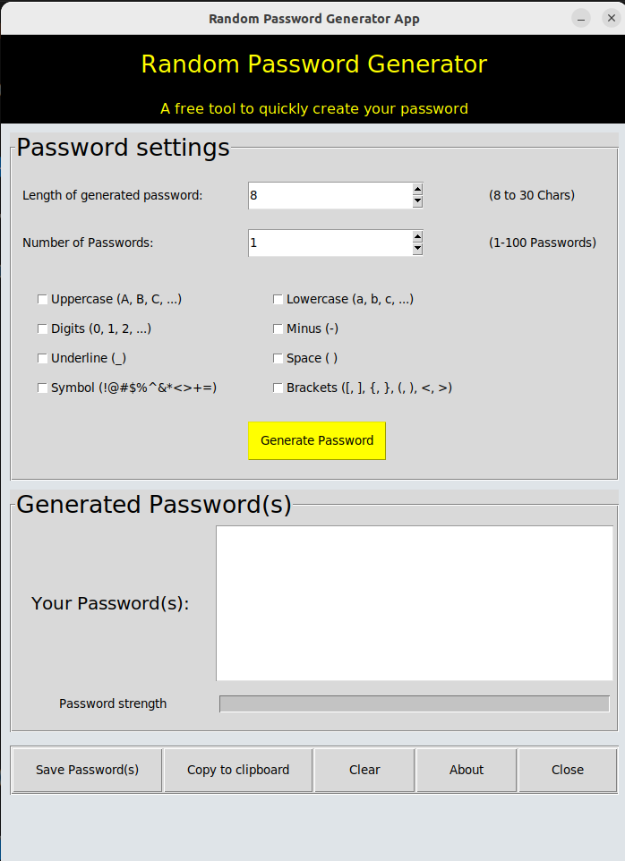

<h1 align='center'> Random Password Generator - Python Tkinter </h1>

<p align='center'>


</p>


## 📂 Table of contents

- [What is Tkinter?](#what-is-tkinter)
- [Discription](#-discription)
- [Installation](#-installation)
- [Requirements](#reqirements)
- [Feature](#-features)
- [Screenshots](#-screenshots)
- [License](#license)
- [Demo](#demo)


## What is Tkinter?

[**Tkinter**](https://docs.python.org/3/library/tkinter.html) is the standard GUI library for Python. It allows developers to create desktop applications with simple widgets like buttons, labels, entries, etc. Tkinter is built into Python, so no additional installation is required for most environments.


## 📝 Discription


## 🚀 Installation

1. Clone the repository:
```
git clone https://github.com/shiva-rsl/random_password_generator.git
```

2. Navigate to the project directory:
```
cd random_password_generator
```

3. Run the Random Password Generator command-line version:
```
python random_password_generator_CLI.py
```

4. Run the Random Password Generator GUI version:
```
python random_password_generator_GUI.py
```


## ⚙️ Reqirements

- Python 3.12+
- Tkinter (comes pre-installed with Python)


## ✨ Features

## 📸 Screenshots




## 🧾 License

This project is licensed under the MIT License.

For more information please view the [License Discription](https://choosealicense.com/licenses/mit/)


## 📽️ Demo

Coming soon...


